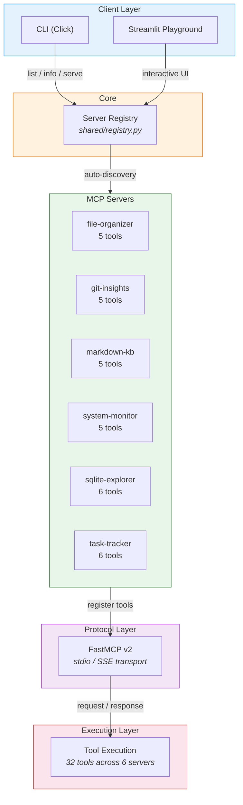

[](https://github.com/sponsors/ChunkyTortoise)

# MCP Toolkit

6 production-ready MCP (Model Context Protocol) servers + CLI discovery tool + Streamlit playground.

MCP is the open standard for connecting AI assistants to external tools. This toolkit provides ready-to-use servers covering common development workflows: database operations, file management, knowledge search, system monitoring, git analytics, and task tracking.


## What This Solves

- **Slow tool integration** — Stand up MCP servers in minutes instead of weeks
- **Fragmented workflows** — One toolkit for data, files, git, monitoring, and tasks
- **Weak governance** — Consistent server specs and auto-discovery for safer deployments

## Demo

Live demo: https://ct-mcp-toolkit.streamlit.app

## Architecture



### Directory Layout

```
mcp-toolkit/
├── mcp_toolkit/
│   ├── servers/           # 6 MCP server implementations
│   │   ├── sqlite_explorer.py    # SQLite CRUD + schema introspection
│   │   ├── file_organizer.py     # File search, dedup, metadata
│   │   ├── markdown_kb.py        # TF-IDF search over markdown docs
│   │   ├── system_monitor.py     # CPU/memory/disk/network via psutil
│   │   ├── git_insights.py       # Repo analytics + contributor stats
│   │   └── task_tracker.py       # Task CRUD with dependency graphs
│   ├── shared/registry.py        # Server auto-discovery
│   └── cli.py                    # CLI: list, info, config, serve
├── app.py                         # Streamlit playground
├── demo_data/                     # Sample files for file-organizer
├── demo_docs/                     # Sample markdown for markdown-kb
└── tests/                         # 180+ pytest tests
```

## Server Catalog

| Server | Tools | Description |
|--------|-------|-------------|
| **sqlite-explorer** | 6 | SQLite database CRUD and schema introspection |
| **file-organizer** | 5 | Smart file search, deduplication, metadata extraction |
| **markdown-kb** | 5 | Knowledge base search using TF-IDF over markdown documents |
| **system-monitor** | 5 | Real-time CPU, memory, disk, and network monitoring |
| **git-insights** | 5 | Git repository analytics, blame, contributor statistics |
| **task-tracker** | 6 | Task management with priorities and dependency graphs |

## Quick Start

### Install

```bash
git clone https://github.com/ChunkyTortoise/mcp-toolkit.git
cd mcp-toolkit
pip install -e .
```

### Discover Servers

```bash
mcp-toolkit list              # List all 6 servers
mcp-toolkit info sqlite-explorer  # Show server tools and details
```

### Configure with Claude Desktop / Claude Code

```bash
mcp-toolkit config sqlite-explorer
```

Output:
```json
{
  "mcpServers": {
    "sqlite-explorer": {
      "command": "mcp-toolkit",
      "args": ["serve", "sqlite-explorer"]
    }
  }
}
```

### Launch a Server

```bash
mcp-toolkit serve sqlite-explorer
```

### Try the Playground

```bash
make demo
```

## Server Details

### sqlite-explorer
Database operations without writing SQL.

| Tool | Description |
|------|-------------|
| `create_database` | Create DB with tables from schema dict |
| `query` | Parameterized SELECT queries (rejects mutations) |
| `insert` | Insert a single row |
| `update` | Update rows matching WHERE clause |
| `delete` | Delete rows matching WHERE clause |
| `get_schema` | Introspect tables, columns, and types |

### file-organizer
Smart file operations for AI-driven workflows.

| Tool | Description |
|------|-------------|
| `search_files` | Recursive glob with depth control |
| `find_duplicates` | SHA-256 content deduplication |
| `get_metadata` | File size, timestamps, MIME, hash |
| `analyze_directory` | Size breakdown by extension |
| `bulk_rename` | Regex rename with dry-run safety |

### markdown-kb
Search knowledge bases using TF-IDF ranking.

| Tool | Description |
|------|-------------|
| `index_documents` | Build search index from markdown files |
| `search` | Cosine similarity ranked search |
| `get_document` | Retrieve full document content |
| `list_documents` | List all indexed documents |
| `get_stats` | Corpus statistics and vocabulary size |

### system-monitor
Infrastructure observability for AI agents.

| Tool | Description |
|------|-------------|
| `get_cpu_stats` | Usage percent, cores, frequency |
| `get_memory_stats` | Total/used/available memory |
| `get_disk_stats` | Disk usage for any mount point |
| `get_network_stats` | Network I/O and connection count |
| `health_check` | Pass/fail against CPU/memory thresholds |

### git-insights
Repository analytics without complex git commands.

| Tool | Description |
|------|-------------|
| `get_repo_stats` | Commits, contributors, branches |
| `get_commit_history` | Recent commits with metadata |
| `get_blame` | Line-by-line authorship |
| `get_contributor_stats` | Per-author commit counts |
| `find_large_files` | Files exceeding size threshold |

### task-tracker
Task management with dependency resolution.

| Tool | Description |
|------|-------------|
| `create_task` | Create task with priority (0-4) |
| `update_task` | Update title, description, status, priority |
| `delete_task` | Delete task and clean up dependencies |
| `list_tasks` | Filter by status and priority |
| `add_dependency` | Add task-to-task dependency |
| `get_ready_tasks` | Find unblocked pending tasks |

## Architecture Decisions

| ADR | Title | Status |
|-----|-------|--------|
| [ADR-0001](docs/adr/0001-fastmcp-v2-over-raw-protocol.md) | FastMCP v2 Over Raw Protocol | Accepted |
| [ADR-0002](docs/adr/0002-six-server-modularity.md) | Six-Server Modularity | Accepted |
| [ADR-0003](docs/adr/0003-analytics-cost-tracking.md) | Analytics and Cost Tracking | Accepted |

## Benchmarks

See [BENCHMARKS.md](BENCHMARKS.md) for methodology and results. Key numbers:

| Operation | P50 | Throughput |
|-----------|-----|------------|
| JSON-RPC Serialize/Deserialize | 0.35ms | 2,645 ops/sec |
| Tool Dispatch + Validation | 0.06ms | 11,987 ops/sec |
| Server Registry Lookup | 0.04ms | 15,562 ops/sec |
| Capability Negotiation | 0.96ms | 1,000 ops/sec |

## Development

```bash
make test      # Run 180+ pytest tests
make lint      # Ruff lint + format check
make format    # Auto-fix lint + formatting
make demo      # Launch Streamlit playground
```

## Tech Stack

- **[FastMCP](https://gofastmcp.com)** v2 — MCP server framework
- **Click** — CLI interface
- **Streamlit** — Interactive playground
- **psutil** — System monitoring
- **GitPython** — Git operations
- **scikit-learn** — TF-IDF search (markdown-kb)

## Key Metrics

| Metric | Value |
|--------|-------|
| MCP Servers | 6 |
| Total Tools | 32 |
| Test Suite | 180+ pytest tests |
| Python | 3.11+ |
| Protocol | FastMCP v2 (stdio / SSE) |
| CI | GitHub Actions |
| License | MIT |

## Service Mapping

- Service 24: Knowledge Management
- Service 6: AI-Powered Personal and Business Automation
- Service 21: Workflow Optimization

## Certification Mapping

- IBM RAG and Agentic AI Professional Certificate
- Duke University LLMOps Specialization
- Google Cloud Generative AI Leader Certificate
- Vanderbilt Generative AI Strategic Leader Specialization

## Changelog

See [CHANGELOG.md](CHANGELOG.md) for release history.

## Related Projects

- [EnterpriseHub](https://github.com/ChunkyTortoise/EnterpriseHub) -- Real estate AI platform with BI dashboards and CRM integration
- [ai-orchestrator](https://github.com/ChunkyTortoise/ai-orchestrator) -- AgentForge: unified async LLM interface (Claude, Gemini, OpenAI, Perplexity)
- [llm-integration-starter](https://github.com/ChunkyTortoise/llm-integration-starter) -- Production LLM patterns: completion, streaming, function calling, RAG, hardening
- [Portfolio](https://chunkytortoise.github.io) -- Project showcase and services

## License

MIT
